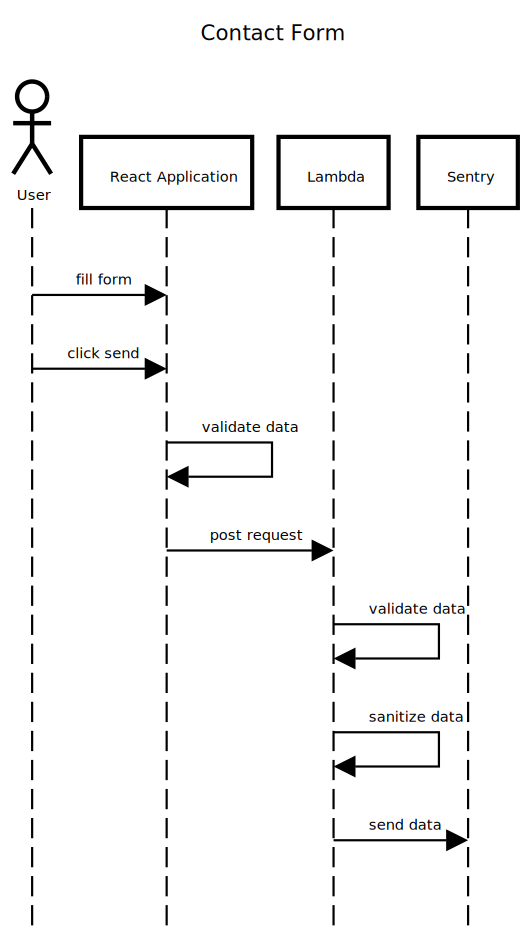

# Building a Contact Form in React

[https://demo.garciadiazjaime.com/react-contact-form](https://demo.garciadiazjaime.com/react-contact-form)

When working on a web application, a contact form is often required. While seemingly simple, it can quickly become complex.

A **Contact Form** requires:

- **UI Composition**: At least one input field and a submit button.
- **Client Validation**: Ensure required fields are not empty.
- **Backend Service**: Receives a POST request from the client and performs several tasks:
  - **Validation**: Similar to client-side, but crucial on the server side to ensure data integrity.
  - **Sanitization**: Cleaning user input is important because the backend should never trust it.
  - **Send**: Send the data via email or save it to a database if all checks pass.
- **Client Feedback**: Inform the user that the message has been sent.

## Demo

I created a simple [demo](https://demo.garciadiazjaime.com/react-contact-form) of a contact form using:

- **React + Next.js**: To build a static website, hosted for free on Netlify.
- **Lambda Function**: The client app uses a lambda as a proxy, also deployed for free on Netlify.
- **Sendgrid**: An email service with a free tier and an npm package.

## Sequence Diagram

The web application is a static site that renders the contact form. When the user fills in the fields and clicks send, the data is validated and sent as a POST request to the lambda function, which validates and sanitizes the data before using Sendgrid to send it to an email address.

## Final Thoughts

To keep it simple, I didn't use any UI libraries, but options like MUI, Antd, and Chakra UI can help build the UI. Alternatives to Sendgrid include Mailchimp or AWS SES, or comprehensive services like EmailJS, which handle backend work, allowing you to focus on the frontend.

Regardless of the tools used, the architectural components needed for a contact form are the same:

- UI Composition
- Validation
- Sanitization
- Sending
- Feedback

Demo:

[https://demo.garciadiazjaime.com/react-contact-form](https://demo.garciadiazjaime.com/react-contact-form)

Repository:

[https://github.com/garciadiazjaime/tutorial-react-contact-form](https://github.com/garciadiazjaime/tutorial-react-contact-form)
